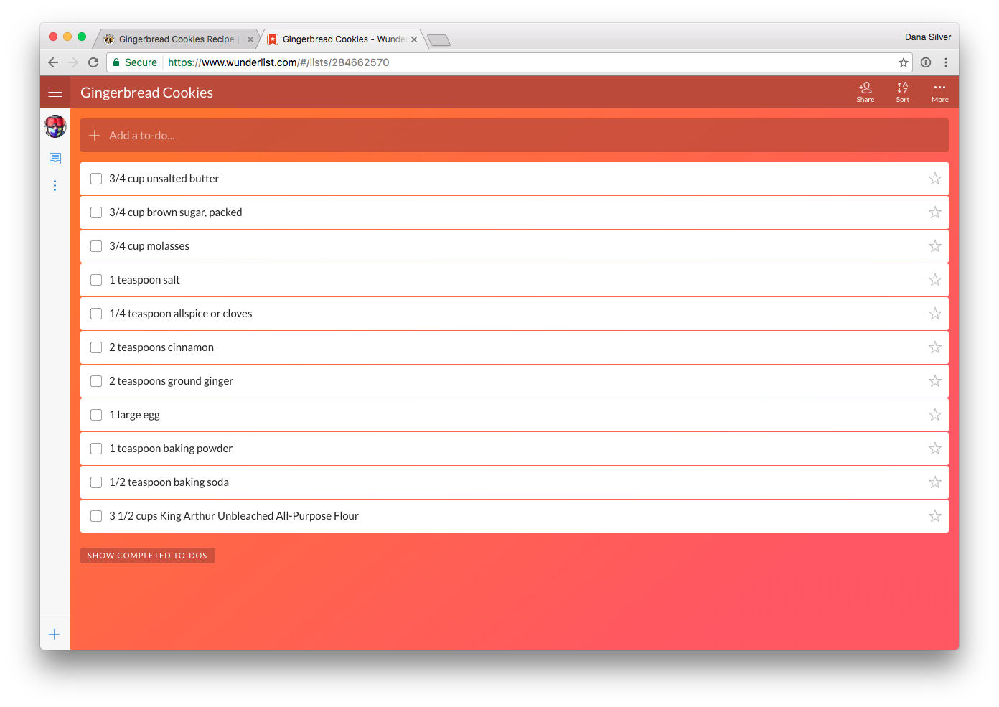

### KAF to Wunderlist

Save your King Arthur Flour ingredient lists to Wunderlist.

#### Getting Started

Install the extension then...

Login to Wunderlist from the options page, and set a Wunderlist folder to save
to, if you like.

Find a King Arthur Flour recipe you want to save.

Your ingredient list is waiting in Wunderlist!

